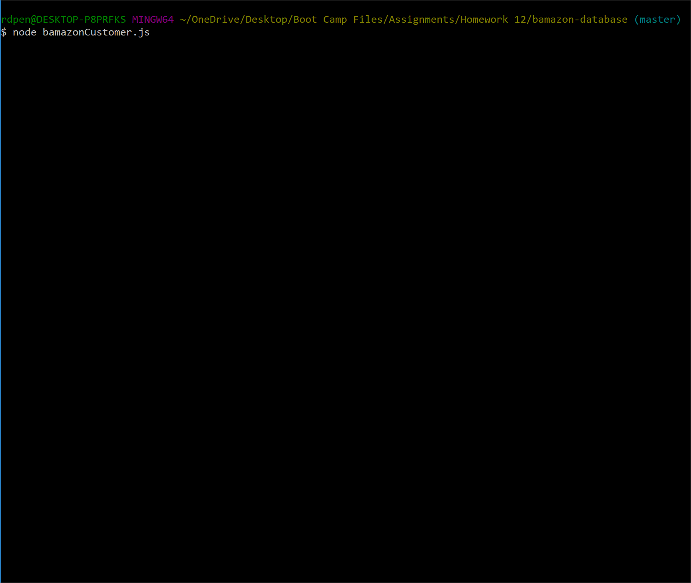
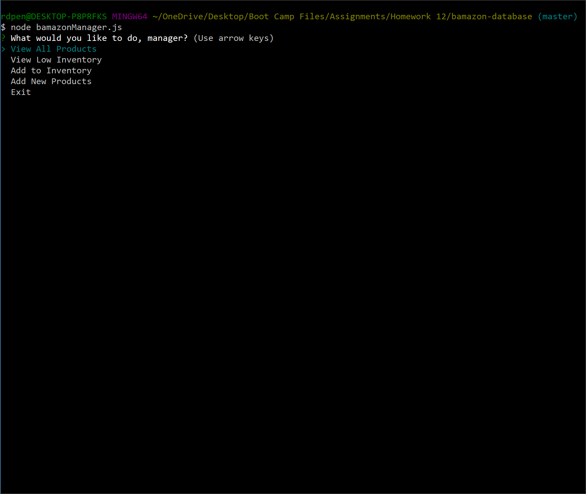

# bamazon-database

This is an application that uses mySQL to create tables and store data that is then accessed through node to view or edit. There are three levels of access (Customer, Manager, and Supervisor).

A npm package and seed file are provided for you to use. After downloading the repository, run the mySQL schema and seed files. Then ```npm install``` on your command line. You should be able to access and run each JS file after that.
___

## Customer


```node bamazonCustomer.js```

This application shows the user (customer) all items that are on sale. They are then prompted to choose an item, and how many they would like to buy. The JS file then calculates the total cost of this purchase and updates the mySQL database.

If the stock of the item selected is too low, it will notify the user and close the node connection. 

___

## Manager


```node bamazonManager.js```

This application allows the user (manager) to view all products for sale, view all items that are stocked with 5 or less items, add to an item's inventory, and add a new item to the store. 

The first two options provide tables for the user. When adding new stock to your current inventory, the user is prompted to select an item, and then provide the quantity that will be added. The last option, adding an entirely new item, will ask the user to provide an item name, department name, price and quanity. These changes will be reflected on the table from the view inventory option.

___
<<<<<<< HEAD
## Supervisor
=======
>>>>>>> 8acc9751fbf1792d6a3787c97728083ec7c21933


```node bamazonSupervisor.js```

The last application allows the user (supervisor) to view total profits and add a new department to Bamazon. The total profit table is calculated when the user selects this option. This updates whenever something is bought using the customer application. 

The second option allows the user to add a new department and set an overhead cost. After doing this, the user must add an item that is from this department using the manager application, and then purchase this item in the customer application. After this, the new department will show up when the user views total profits.
___
